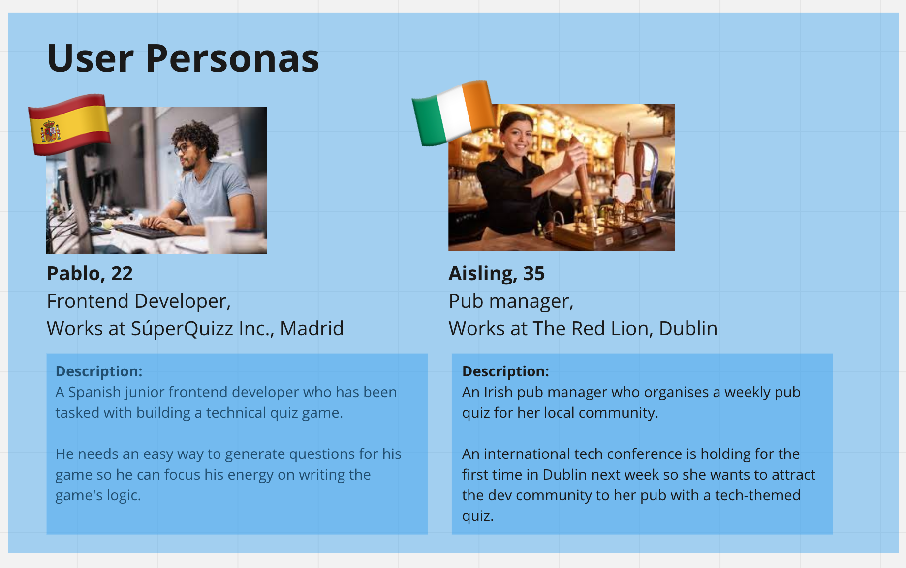
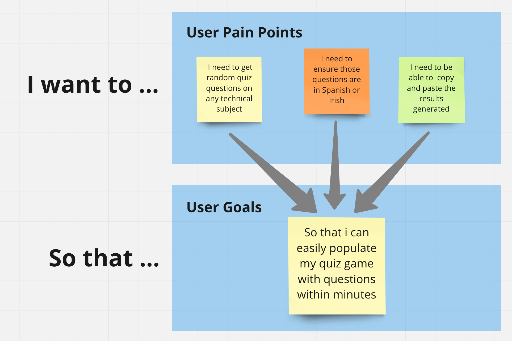

# Multi-language Quiz Question Generator

## A simple tool for anyone making a quiz to generate questions in any language of their choice.

## Built by: [Yvonne](https://github.com/yvonnesarah), [Ugo](https://github.com/Ugopreneur) & [Martin](https://github.com/martinjnamara)

----------------------------------

## Table of Contents

If your README is long, add a table of contents to make it easy for users to find what they need.

- [Description](#description)
- [Installation](#installation)
- [Usage](#usage)
- [Team](#team)
- [Credits](#credits)
- [License](#license)

## Description

The Multi-Language Quiz Question Generator project will create an application which allows a developer(user) to generate quiz questions on a selected topic and return the response in a language of choice. The User will select the subject of interest from initially a limited selection of subjects. The user will also select the language for the response to be presented in. (Again, there will be a limited number of languages available for selection). Once these two selections have been made, The user is able to specify the number of questions to be generated. Once these three selections have been made, a "Generate Questions" button is clicked.  This code will then make two separate and distinct API queries to two distinct remote endpoints. These queries are made consecutively with the second query making use of information returned in he first query. These will both return JSON responses which will need to be processed to render the appropriate output on a second fra

The Motivation for this project was to find an application that could be realistically developed within the scope of the available time and resources which would demonstrate the full range of technologies encountered to date in the Web Front-end course 

This project provides the basis for a game which might be used for educational or for entertainment purposes. It allows questions to be generated in specific subjects and for these questions and their answers to be framed in a language of choice 

We learnt the power of collaboration. Although difficult due to the differences in physical locations, we rapidly developed an effective modus operandi for progressing the project goals. This was done in a team-spirited way, where team members used their individual skills to ensure that the team made common progress. This project provided an excellent basis for reviewing and cementing the concepts and the technologies that have been exposed in the course to date. It was also particularly useful to work using a team approach where all aspects of the project were subjected to group scrutiny and review. We adopted as far as was reasonable an Agile approach where we attempted to develop the minimum viable project (MVP), for the application using approach where we re-used code where this applied, (DRY)

#### User Personas
<p align="center">
  
</p>

#### User Story
<p align="center">
  
</p>

## Installation

What are the steps required to install your project? Provide a step-by-step description of how to get the development environment running.

## Usage

Provide instructions and examples for use. Include screenshots as needed.

To add a screenshot, create an `assets/images` folder in your repository and upload your screenshot to it. Then, using the relative filepath, add it to your README using the following syntax:

    ```md
    
    ```

## Team

#### Yvonne
<p align="center">
  
</p>

#### Ugo
<p align="center">
  
</p>

#### Martin
<p align="center">
  
</p>

## Credits

This work leans heavily on work carried out as coursework, where due credit must be given to the course instructor, and the Technical Assistants 
If you used any third-party assets that require attribution, list the creators with links to their primary web presence in this section.

If you followed tutorials, include links to those here as well.

## License

This project has adopted the MIT licence terms

---


## Badges


Badges aren't necessary, per se, but they demonstrate street cred. Badges let other developers know that you know what you're doing. Check out the badges hosted by [shields.io](https://shields.io/). You may not understand what they all represent now, but you will in time.

## Features

If your project has a lot of features, list them here.

## How to Contribute

If you created an application or package and would like other developers to contribute it, you can include guidelines for how to do so. The [Contributor Covenant](https://www.contributor-covenant.org/) is an industry standard, but you can always write your own if you'd prefer.

## Tests

Go the extra mile and write tests for your application. Then provide examples on how to run them here.
