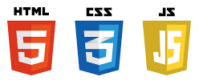
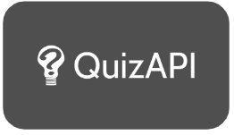

# Quiz Maker

## A simple tool for anyone making a quiz to generate questions in seconds! 🌍 Any language 📚 Any category 🔢 Any quantity  Built by: [Yvonne](https://github.com/yvonnesarah), [Ugo](https://github.com/Ugopreneur) & [Martin](https://github.com/martinjnamara)

## Table of Contents

- [Description](#description)
- [Screenshots](#screenshots)
- [Technologies used](#technologies-used)
- [Future considerations](#future-considerations)
- [Team](#team)
- [Credits](#credits)
- [License](#license)

## Description

Quiz Maker is a multi-language quiz question generator. 

It allows the user to generate quiz questions on any selected topic and returns the response in any language of their choice. The user is also able to specify the number of questions to be generated. 

#### Who it's made for (target audience)

  

#### Why they want it (user story)

  

## Screenshots

Here are some screenshots of the deployed application in use.

### Home page where user selects options

### Results page where user sees questions generated

### Both pages built to be mobile responsive

## Technologies used

### Code
  

### APIs
[Quiz API](https://quizapi.io/) & [Text Translator API](https://rapidapi.com/dickyagustin/api/text-translator2/)

  

### Others
  

## Future considerations

Features and improvements to maybe add someday.
1. Indicate the correct answer among response options
2. Handling a question with commas (code currently breaks if a question has a comma in it)
3. More topics (more question sourcing APIs) and more language options
4. Adjustable difficulty levels
5. ‘Generate Questions’ button could dynamically change plurality if user selects multiple questions
6. Add buttons to each card on results page to automatically copy questions generated to the clipboard
7. Allow user reject or accept questions
8. Allow user edit filters directly from results page

## Team

### Github profiles: [Yvonne (yvonnesarah)](https://github.com/yvonnesarah), [Martin (martinjnamara)](https://github.com/martinjnamara) & [Ugo (Ugopreneur)](https://github.com/Ugopreneur)

## Credits

A few sources that helped us build this:

- The brilliant APIs we used: [Quiz API](https://quizapi.io/) & [Text Translator API](https://rapidapi.com/dickyagustin/api/text-translator2/)
- Branding and theme from [Namecheap](https://www.namecheap.com/), Roboto font from [Google fonts](https://fonts.google.com/icons)
- Spinning loader on homepage: Built by [Matheaus2212](https://github.com/Matheus2212/js-simple-loader), sourced from [CSS Script](https://www.cssscript.com/animated-svg-loading-spinner/) 
- The usual tips and resources from [W3Schools](https://www.w3schools.com), [Mozilla.org](https://developer.mozilla.org/en-US/) and [Stack Overflow](https://stackoverflow.com)
- [chatGPT](https://chat.openai.com/) for guidance when we were lost

## License

This project has adopted the MIT licence terms

